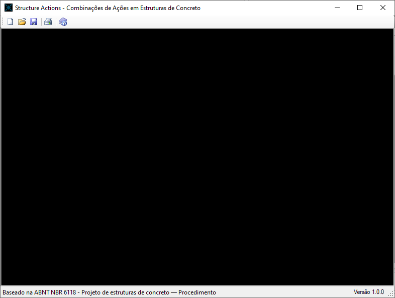
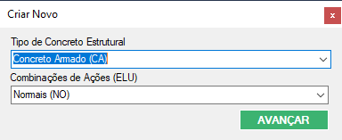
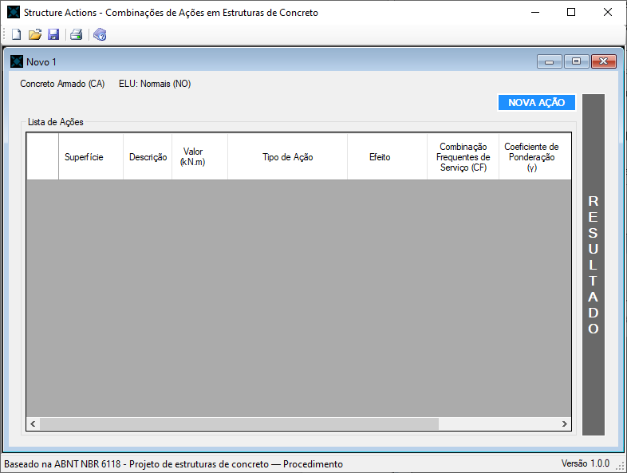
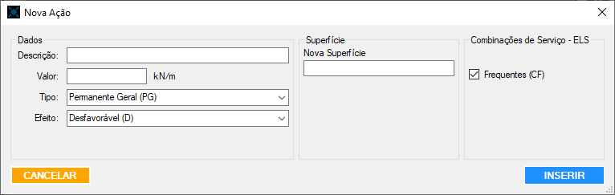
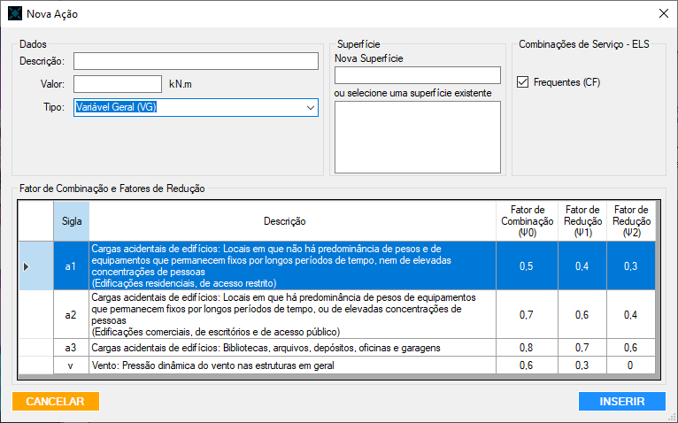
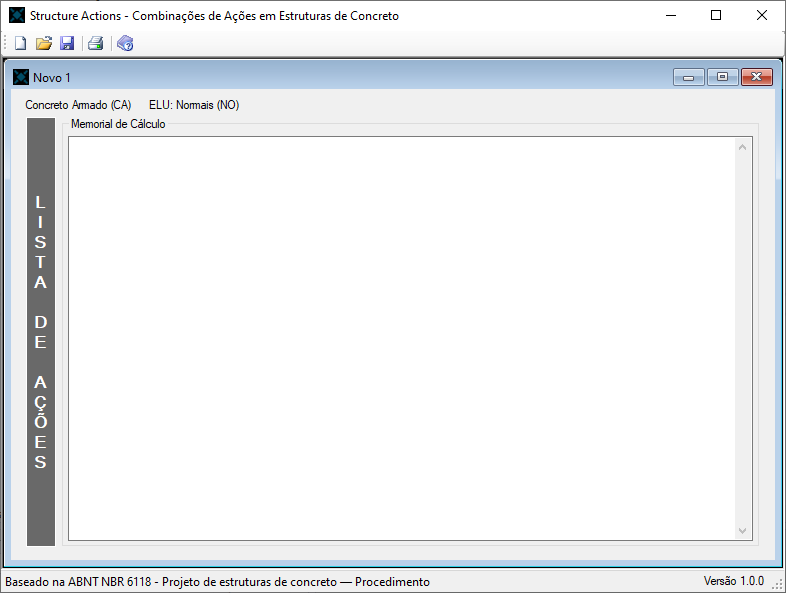
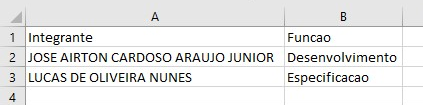
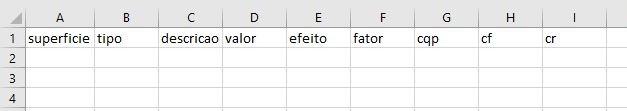
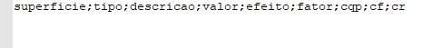

# Structure Actions
<b>TCC:</b> FERRAMENTA COMPUTACIONAL PARA CÁLCULO DE COMBINAÇÕES DE AÇÕES EM ESTRUTURAS DE CONCRETO<br>
<b>Desenvolvido por:</b> Jose Airton Cardoso Araujo Junior e Lucas de Oliveira Nunes<br>
<b>Universidade:</b> Universidade Nove de Julho<br>
<b>Departamento:</b> Engenharia Civil<br>
<b>Orientador:</b> Prof.º Me. Jorge Alberto Cecin<br>

# Justificativ
Muitos estudantes de engenharia civil e até mesmo engenheiros civis, tem muito trabalho e muitas vezes cometem erros no momento dos cálculos de combinações das ações, já que exigem muita atenção para criar as diversas possibilidade de combinações e de coletar os fatores exigidos pela normatização. Atualmente em toda edificação deve ser considerada a atuação do vento, tornando as combinações imprescindíveis.

Fazer um estudo sobre as ações existentes em uma estrutura, a fim de compreender quais são as combinações recomendadas por norma e os fatores dessas combinações, como também entender quais combinações são necessárias para cada tipo de estrutura, é uma das coisas mais importantes na etapa de elaboração de um projeto. Uma ferramenta que auxilia nos cálculos normalmente diminui as chances de erro, tornando-se muito útil, deixando simples o que antes era muito trabalhoso.

A ferramenta computacional conta com um modo simples e fácil para o desenvolvimento dos cálculos, que antes tomavam muito tempo e exigiam muito trabalho na hora de fazer todas as combinações, principalmente para as pessoas que têm mais dificuldades, tornando confiável e seguro todo o processo.

# Ferramenta Computacional - Software
Ao desenvolver a ferramenta computacional, foi pensado em algo com uma boa usabilidade, para que qualquer pessoa, mesmo com pouco conhecimento em computadores, conseguisse trabalhar nela. Assim, foi utilizado o padrão do sistema operacional Windows e alguns botões com imagem para ser mais simples de ser utilizado.

Já para as pessoas que sabem mexer em computadores, é possível acessar a maioria dos comandos por meio de “atalhos” ao clicar em teclas especificas no teclado, os atalhos podem ser encontrados na ferramenta. 

Outro recurso é a criação de um importador em formato CSV (ponto e vírgula), para a ferramenta compreender o arquivo de importação foram criadas siglas, geralmente elas estarão entre parênteses e servem para informar determinado item, que será apresentado no Capítulo 9.2 ARQUIVO DE IMPORTAÇÃO. Para auxiliar em futuros ajustes é possível salvar os dados e importar futuramente.

Um item de ajuda foi criado no qual pode-se encontrar todas as informações sobre a ferramenta, além de como utilizá-la e como criar o arquivo de importação. 

# Baixar a Ferramenta Computacional
Click [aqui](https://github.com/AirtonJunior/StructureActions/releases) e baixe os arquivos "setup.exe" e "StructureActions.msi", depois de baixar click duas vezes no arquivo "StructureActions.msi".


# Como Funciona
Ao iniciar a ferramenta ela exibe o Splash Screen e nessa tela é exibido: nome da ferramenta, subtítulo do TCC, nome dos integrantes, nome do orientador e logo da Uninove.

<center>
Splash Screen


</center>

Depois do Splash Screen é aberto a Home (tela principal). Toda a ferramenta funciona dentro dessa tela e é nela que se encontra os principais botões como: criar um projeto, importar dados, salvar os dados, imprimir o resultado, organizar as janelas (telas internas), ajuda, entre outros.

É possível criar um projeto do zero ou importar os dados com o arquivo CSV que será explicado na próxima seção. Quando for salvar os dados é necessário estar com um projeto aberto, entretanto, para imprimir o resultado tem que estar com a página do resultado aberta.

<center>
Tela Home


</center>

Ao clicar em importar (Abrir) ou apertar em Ctrl+O é aberta uma janela para a seleção de um arquivo CSV. Após selecionado, a ferramenta abre a janela “Criar Novo”: essa janela é do tipo diagnóstico que bloqueia o restante da ferramenta até que ela seja fechada pelo botão “X”, que cancela a operação ou pelo botão “AVANÇAR” que conclui a operação. O nome do arquivo é colocado no título da janela e nessa tela tem que ser selecionado o “Tipo de Concreto Estrutural” e “Combinações de Ações (ELU)” e, em seguida, clicar no botão “AVANÇAR”. Com isso a ferramenta faz uma validação de todos os dados para identificar possíveis inconsistências de dados e caso encontre é aberto uma janela informando o que está errado e finaliza o processo de importação. 

Quando importado um arquivo sem erro a ferramenta abre a janela com a lista de ações que será explicada mais a diante. É possível evitar a janela “Criar Novo” inserindo a sigla do “Tipo de Concreto Estrutural” e “Combinações de Ações (ELU)” no nome do arquivo da seguinte forma: 
```
<nomedeidentificacao>_<SiglaTipodeConcretoEstrututal>_<SilgaCombinacaodeAcaoELU>.csv
```
Para o caso do “Tipo de Concreto Estrutural” de “Concreto Armado (CA)” e “Combinações de Ações (ELU)” “Normais (NO)” o nome do arquivo ficará: “edificio_CA_NO.csv”.

<center>
Janela Criar Novo


</center>

Algo parecido ocorre ao clicar em novo ou ao apertar em Ctrl+N na tela de Home, porém não abre uma janela de seleção de arquivos, o título permanece com o texto “Criar Novo” e não é feito nenhuma validação, pois não tem dados para ser avaliados.

O “Tipo de Concreto Estrutural” serve para definir quais as combinações do ELS serão calculadas, conforme a norma. Para as “Combinações de Ações (ELU)” além de saber qual a combinação será utilizada também servirá para definir os coeficientes de ponderação. Opções:  
- Tipo de Concreto Estrutural:
    - Concreto Simples (CS);
    - Concreto Armado (CA);
    - Concreto Protendido Nível 1 (Protensão Parcial - PP);
    - Concreto Protendido Nível 2 (Protensão Limitada - PL);
    - Concreto Protendido Nível 3 (Protensão Completa - PC).
- Combinações de Ações (ELU):
    - Normais (NO);
    - Especiais ou de Construção (EC);
    - Excepcionais (EX).

Após a configuração das informações iniciais é aberto a janela de lista de ações. Nessa janela são informadas as configurações anteriores, com um botão chamado “NOVA AÇÃO” para criar uma ação, uma tabela para mostrar as ações inseridas e um botão chamado “RESULTADO”.

Na tabela são demonstrados campos fixos: Superfície, Descrição, Valor, Tipo de Ação, Efeito, Coeficiente de Ponderação (γ), Fator de Combinação (ψ0), Fator de Redução (ψ1) e Fator de Redução (ψ2). Também existem os campos variáveis que apenas se mostram de acordo com o “Tipo de Concreto Estrutural” que são: Combinação Quase Permanentes de Serviço (CQP), Combinação Frequentes de Serviço (CF) e Combinação Raras de Serviço (CR).

Ao clicar na tabela em uma linha de uma ação existente, uma janela de inserção de ação se abre. As mudanças em tal janela são: em vez do botão “SALVAR” existe um botão “ALTERAR” e um botão “DELETAR” aparece para que a ação seja excluída.


<center>
Lista de Ações


</center>

Quando o botão “NOVA AÇÃO” é pressionado, é aberta uma janela do tipo diagnóstico, com todas as informações que são necessárias para o cálculo e para separar os dados por superfície (elemento construtivo). Para um melhor entendimento segue abaixo a importância de cada dado:

- Descrição: A descrição serve para a identificação das ações, em uma mesma superfície não podem existir descrições iguais, o valor informado deve ser alfanumérico de no mínimo 5 (cinco) caracteres;
- Valor: É o valor numérico do esforço que a ação transmite para a superfície em kN/m;
- Tipo de Ação: Deve ser checada umas das opções de acordo com a ação que está sendo configurada, pois esse valor é utilizado juntamente com outros dados para definir o valor do coeficiente de ponderação (γ). As opções são as seguintes:
    - Permanentes:
        - Gerais (PG);
        - Pretensão (PP);
        - Recalques de apoio e retração (PR).
    - Variáveis:
        - Gerais (VG);
        - Temperatura (VT).
    - Excepcional:
        - Excepcional (EX). 
- Efeito: Informado se a ação permanente é “Desfavorável (D)” ou “Favorável (F)”, é utilizado para identificar o fator de ponderação; 
- Superfície: Informado se a ação permanente é “Desfavorável (D)” ou “Favorável (F)”, é utilizado para identificar o fator de ponderação; 
- Combinações de Ações – ELU: Nessa parte devem ser informadas as combinações do Estado-Limite de Serviço que a ação faz parte, são exibidas as combinações que fazem parte do “Tipo de Concreto Estrutural” de acordo com a norma; A janela do modelo para as ações permanentes pode ser visualizada na figura a seguir: 

<center>
Adição e Edição das Ações


</center>
 
As ações variáveis necessitam de mais informações, porém o fator de combinação e os fatores de redução, não necessitam do efeito. Dessa forma a janela abre mais uma opção em que deve informar a partir de uma tabela a categoria que a ação variável faz parte. Para as ações variáveis gerais existem as três opções de carga acidental e a opção do vento, quando é uma ação variável de temperatura só exibe a opção de temperatura. É possível ver abaixo a figura que demonstra a opção variável geral selecionada.

<center>
Configuração das Ações – Ações Variáveis


</center>

Quando se tenta inserir ou editar uma ação é feita uma validação dos dados, em que é verificado se existe alguma configuração que não está de acordo com a norma ou com a configuração inicial.

Após inserir todas as informações, pode ser visualizado o resultado com o memorial de cálculo ao clicar no botão “RESULTADO”, na janela de lista de ações. Nesse momento é feita uma verificação de inconsistência de dados por superfície e somente se tudo estiver em concordância é possível ver o resultado.

Para as combinações ELU é validado se existe no mínimo uma ação direta permanente e uma ação direta variável, no caso das combinações do ELS é verificado se existe uma ação permanente e uma variável, independentemente se o tipo é direto ou indireto. Quando selecionado a combinação ELU “Excepcionais (EX)” é verificado se existe uma ação deste tipo. 

<center>
Resultado
 

</center>

# Arquivo de Importação
O arquivo de importação é do tipo CSV que significa “comma-separated-values” (valores separados por vírgulas), porém na ferramenta foi utilizado uma variação desse tipo o qual em vez de usar vírgula é utilizado o ponto e vírgula (;). Esse tipo de arquivo é utilizado para transferência de informações entre sistemas distintos, sabendo-se a estrutura dos dados qualquer sistema consegui interpretar, pois sua leitura é como um arquivo de texto simples.

O Excel consegue gerar arquivos CSV, para o tipo separado por ponto e vírgula (;) deve-se “Salvar uma Cópia” e selecionar a opção "CSV (Macintosh) (*.csv)" ou "CSV (MS-DOS) (*.csv)". Além de gerar, o Excel consegue alterar esse tipo de arquivo, tornando a utilização desse arquivo muito versátil por muitas pessoas que sabem utilizar o Excel. A seguir, um exemplo básico de CSV: 

<center>
Exemplo de Arquivo CSV no Excel
 

</center>

<center>
Exemplo de Arquivo CSV no Editor de Texto
 

</center>

Para a Ferramenta entender o arquivo de importação é preciso que na primeira linha tenha um cabeçalho com os seguintes campos: “superfície”, “tipo”, “descrição”, “valor”, “efeito”, “fator”, “cqp”, “cf” e “cr”, já nas demais linhas, as informações correspondentes de cada ação, sendo uma por linha. Basicamente o arquivo de importação salva todas as ações a partir de uma planilha orientada, dessa forma isso ajuda o usuário a inserir de forma mais prática as ações.

A seguir a explicação de cada um dos itens do cabeçalho:
- superfície – Informa a superfície que a ação está situada, é um valor alfanumérico de no mínimo 3 caracteres;
- tipo – Informa o tipo de ação, um dos tipos a seguir:
    - PG – Permanente Geral; 
    - PP – Permanente de Protensão (Utilizado quando o Tipo de Concreto Estrutural for um dos 3 níveis de Concreto Protendido); 
    - PR – Permanente de Recalques de Apoio e Retração;
    - VG – Variável Geral;
    - VT – Variável de Temperatura;
    - EX – Excepcional (Utilizado somente para a Combinações Excepcionais do ELU).
- descricao – Informa uma descrição para identificação da ação, é um valor alfanumérico de no mínimo 5 caracteres;
- valor – Informa o valor da força atuante na estrutura em kN/m, é um valor numérico;
- efeito – Serve para identificar o fator de ponderação da ação permanente, utilize um dos tipos a seguir:
    - D – Desfavorável;
    - F – Favorável;
    - OBS.: Vazio para as ações variáveis. 
- fator – Serve para identificar os fatores de combinação e redução para as ações variáveis, utilize um dos tipos a seguir:
    - Para VG – Variável Geral:
        - A1 – Cargas acidentais de edifícios: Locais em que não há predominância de pesos e de equipamentos que permanecem fixos por longos períodos de tempo, nem de elevadas concentrações de pessoas (Edificações residenciais, de acesso restrito);
        - A2 – Cargas acidentais de edifícios: Locais em que há predominância de pesos de equipamentos que permanecem fixos por longos períodos de tempo, ou de elevadas concentrações de pessoas (Edificações comerciais, de escritórios e de acesso público);
        - A3 – Cargas acidentais de edifícios: Bibliotecas, arquivos, depósitos, oficinas e garagens;
        - V – Vento: Pressão dinâmica do vento nas estruturas em geral.
    - Para VT – Variável de Temperatura:
        - T – Temperatura: Variações uniformes de temperatura em relação à média anual local 
    - OBS.: Vazio para as ações permanentes. 	
- cqp: Informa se a ação é para ser utilizada no cálculo de “Combinação quase permanente”, somente para “Concreto Protendido Nível 1 (Protensão Parcial - PP)”. Utilize um dos tipos a seguir:
    - S – Sim;
    - N – Não;
    - OBS.: Vazio para os demais Tipo de Concreto Estrutural.
- cf: Informa se a ação é para ser utilizada no cálculo de “Combinação frequente”, para todos os Tipos de Construção Estrutural com exceção da “Concreto Simples (CS)”. Utilize um dos tipos a seguir: 
    - S – Sim;
    - N – Não;
    - OBS.: Vazio para os demais Tipo de Concreto Estrutural.
- cr: Informa se a ação é para ser utilizada no cálculo de “Combinação rara”, somente para “Concreto Protendido Nível 3 (Protensão Completa - PC)”. Utilize um dos tipos a seguir: 
    - S – Sim;
    - N – Não;
    - OBS.: Vazio para os demais Tipo de Concreto Estrutural.

A seguir exemplo do cabeçalho no Excel e no Editor de Texto:

<center>
Exemplo do Cabeçalho no Excel
 

</center>

<center>
Exemplo do Cabeçalho no Editor de Texto
 

</center>

# TCC na Íntegra
Click [aqui](https://github.com/AirtonJunior/StructureActions/tree/master/tcc)